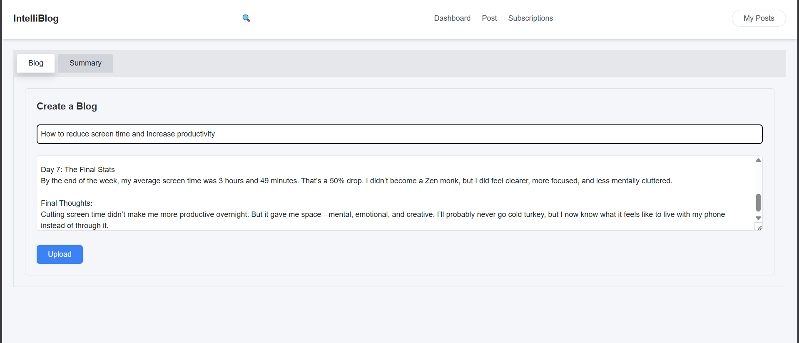

# BlogPlatform

A full‑stack blogging platform with AI-powered features: semantic search, title similarity search, and automatic summarization. This repo contains a Node/Express backend (blog-api) and a React frontend (frontend). The app indexes blog posts into a vector store (Qdrant) and uses Hugging Face / local sentence-transformer models to generate embeddings.

## Key features
- Create, edit and view blog posts
- Title-based semantic similarity search (find posts by similar titles)
- Content semantic search (query by meaning using vector embeddings)
- AI summarization of blog content
- Author and snippet metadata returned with search results
- Embedding caching (Redis) and vector indexing (Qdrant)

## Screenshots
- Dashboard: images/Dashboard.png  
  

- Create / Posting: images/Posting.png  
  

- View post: images/View.png  
  

- Semantic search (content): images/SemanticSearch.png  
  Demonstrates similarity search of blog posts based on semantic similarity of content and query.  
  

- Title search: images/TitleSearch.png  
  Demonstrates title-based semantic similarity search of blog posts.  
  

- Summarization: images/Summarize.png  
  Demonstrates AI-based summarization of blog content.  
  

- Login and Register (side-by-side, small width):  
  <table><tr>
  <td></td>
  <td></td>
  </tr></table>

## How it works (brief)
- When a blog is created/updated, the backend generates embeddings for the title and content (using Hugging Face inference or a local model) and upserts two vectors into Qdrant (one for title, one for content).
- Semantic search: the user query is embedded, then Qdrant is queried for nearest vectors (content or title). Results include payload metadata (blogId, title, snippet, author).
- Title search: a focused search against title vectors to find posts with similar titles.
- Summarization: an AI model is used to produce a shorter summary of the post content on demand.
- Results with similarity below 50% are filtered out on the frontend.

## Getting started

Prerequisites
- Node.js (v16+ recommended)
- npm or yarn
- MongoDB (or connection string to MongoDB Atlas)
- Qdrant running locally or accessible remotely (default: http://localhost:6333)
- Redis (optional, used for embedding cache)
- (Optional) Local embedding server OR a Hugging Face API token

## Tech stack
- Backend: Node.js, Express, Mongoose
- Vector DB: Qdrant
- Embeddings: Hugging Face Inference API / local sentence-transformer
- Cache: Redis (optional)
- Frontend: React
